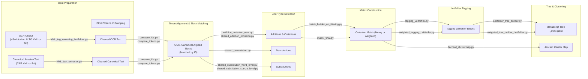

```mermaid

graph LR

  %% Invisible class for padding nodes (prevents title overlap)
  classDef invisible fill:transparent,stroke:transparent,opacity:0;

  %% -------- Input Preparation --------
  subgraph "Input Preparation"
    pad1[" "]:::invisible
    canonical_text["Canonical Avestan Text<br/>(CAB XML or flat)"]
    ocr_text["OCR Output<br/>(eScriptorium ALTO XML or flat)"]
    stanza_mapping["Block/Stanza ID Mapping"]
    cleaned_canonical["Cleaned Canonical Text"]
    cleaned_ocr["Cleaned OCR Text"]

    canonical_text -->|"XML_text_extractor.py"| cleaned_canonical
    ocr_text -->|"XML_tag_removing_Leitfehler.py"| cleaned_ocr
  end

  %% -------- Token Alignment & Block Matching --------
  subgraph "Token Alignment & Block Matching"
    pad2[" "]:::invisible
    comparison_output["OCR–Canonical Aligned Blocks<br/>(Matched by ID)"]

    cleaned_ocr -->|"compare_ids.py<br/>compare_tokens.py"| comparison_output
    cleaned_canonical -->|"compare_ids.py<br/>compare_tokens.py"| comparison_output
  end

  %% -------- Error Type Detection --------
  subgraph "Error Type Detection"
    pad3[" "]:::invisible
    additions_omissions["Additions & Omissions"]
    permutations["Permutations"]
    substitutions["Substitutions"]

    comparison_output -->|"addition_omission_new.py<br/>shared_addition_omission.py"| additions_omissions
    comparison_output -->|"shared_permutation.py"| permutations
    comparison_output -->|"shared_substitution_word_level.py<br/>shared_substitution_stanza_level.py"| substitutions
  end

  %% -------- Matrix Construction --------
  subgraph "Matrix Construction"
    pad4[" "]:::invisible
    omission_matrix["Omission Matrix (binary or weighted)"]

    additions_omissions -->|"matrix_builder_no_filtering.py"| omission_matrix
    additions_omissions -->|"matrix_final.py"| omission_matrix
  end

  %% -------- Leitfehler Tagging --------
  subgraph "Leitfehler Tagging"
    pad5[" "]:::invisible
    leitfehler_tags["Tagged Leitfehler Blocks"]

    omission_matrix -->|"tagging_Leitfehler.py"| leitfehler_tags
    omission_matrix -->|"weighted_tagging_Leitfehler.py"| leitfehler_tags
  end

  %% -------- Tree & Clustering --------
  subgraph "Tree & Clustering"
    pad6[" "]:::invisible
    tree_output["Manuscript Tree (.nwk/.json)"]
    cluster_map["Jaccard Cluster Map"]

    leitfehler_tags -->|"Leitfehler_tree_builder.py"| tree_output
    leitfehler_tags -->|"weighted_tree_builder_Leitfehler.py"| tree_output
    omission_matrix -->|"Jaccard_clustermap.py"| cluster_map
  end
```