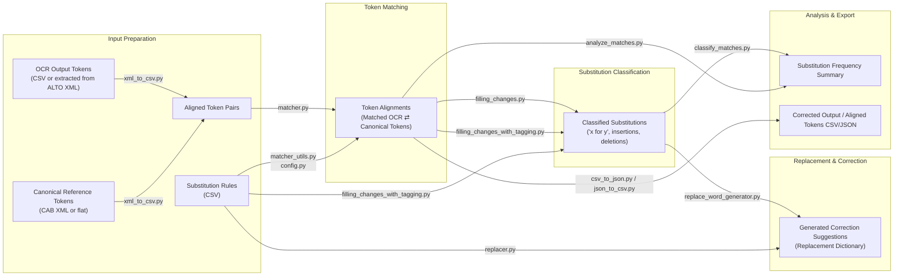

```mermaid
graph LR

  %% Invisible class for padding nodes (prevents title overlap)
  classDef invisible fill:transparent,stroke:transparent,opacity:0;

  %% -------- Input Preparation --------
  subgraph "Input Preparation"
    pad1[" "]:::invisible
    ocr_tokens["OCR Output Tokens<br/>(CSV or extracted from ALTO XML)"]
    canonical_tokens["Canonical Reference Tokens<br/>(CAB XML or flat)"]
    substitution_rules["Substitution Rules<br/>(CSV)"]
    aligned_pairs["Aligned Token Pairs"]

    ocr_tokens -->|"xml_to_csv.py"| aligned_pairs
    canonical_tokens -->|"xml_to_csv.py"| aligned_pairs
  end

  %% -------- Token Matching --------
  subgraph "Token Matching"
    pad2[" "]:::invisible
    matcher_output["Token Alignments<br/>(Matched OCR ⇄ Canonical Tokens)"]

    aligned_pairs -->|"matcher.py"| matcher_output
    substitution_rules -->|"matcher_utils.py<br/>config.py"| matcher_output
  end

  %% -------- Substitution Classification --------
  subgraph "Substitution Classification"
    pad3[" "]:::invisible
    classified_matches["Classified Substitutions<br/>('x for y', insertions, deletions)"]

    matcher_output -->|"filling_changes.py"| classified_matches
    matcher_output -->|"filling_changes_with_tagging.py"| classified_matches
    substitution_rules -->|"filling_changes_with_tagging.py"| classified_matches
  end

  %% -------- Replacement & Correction --------
  subgraph "Replacement & Correction"
    pad4[" "]:::invisible
    replacements["Generated Correction Suggestions<br/>(Replacement Dictionary)"]

    classified_matches -->|"replace_word_generator.py"| replacements
    substitution_rules -->|"replacer.py"| replacements
  end

  %% -------- Analysis & Export --------
  subgraph "Analysis & Export"
    pad5[" "]:::invisible
    substitution_stats["Substitution Frequency Summary"]
    final_output["Corrected Output / Aligned Tokens CSV/JSON"]

    classified_matches -->|"classify_matches.py"| substitution_stats
    matcher_output -->|"analyze_matches.py"| substitution_stats
    matcher_output -->|"csv_to_json.py / json_to_csv.py"| final_output
  end

```
