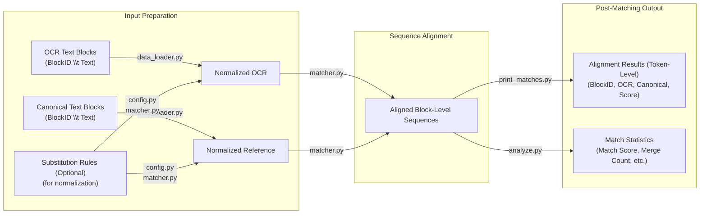

```mermaid

graph LR

  %% Invisible class for padding nodes (prevents title overlap)
  classDef invisible fill:transparent,stroke:transparent,opacity:0;

  %% -------- Input Preparation --------
  subgraph "Input Preparation"
    pad1[" "]:::invisible
    ocr_text_blocks["OCR Text Blocks<br/>(BlockID \\t Text)"]
    reference_text_blocks["Canonical Text Blocks<br/>(BlockID \\t Text)"]
    substitution_rules["Substitution Rules (Optional)<br/>(for normalization)"]
    normalized_ocr["Normalized OCR"]
    normalized_ref["Normalized Reference"]

    ocr_text_blocks -->|"data_loader.py"| normalized_ocr
    reference_text_blocks -->|"data_loader.py"| normalized_ref
    substitution_rules -->|"config.py<br/>matcher.py"| normalized_ocr
    substitution_rules -->|"config.py<br/>matcher.py"| normalized_ref
  end

  %% -------- Sequence Alignment --------
  subgraph "Sequence Alignment"
    pad2[" "]:::invisible
    aligned_blocks["Aligned Block-Level Sequences"]

    normalized_ocr -->|"matcher.py"| aligned_blocks
    normalized_ref -->|"matcher.py"| aligned_blocks
  end

  %% -------- Post-Matching Output --------
  subgraph "Post-Matching Output"
    pad3[" "]:::invisible
    alignment_csv["Alignment Results (Token-Level)<br/>(BlockID, OCR, Canonical, Score)"]
    alignment_analysis["Match Statistics<br/>(Match Score, Merge Count, etc.)"]

    aligned_blocks -->|"print_matches.py"| alignment_csv
    aligned_blocks -->|"analyze.py"| alignment_analysis
  end
```