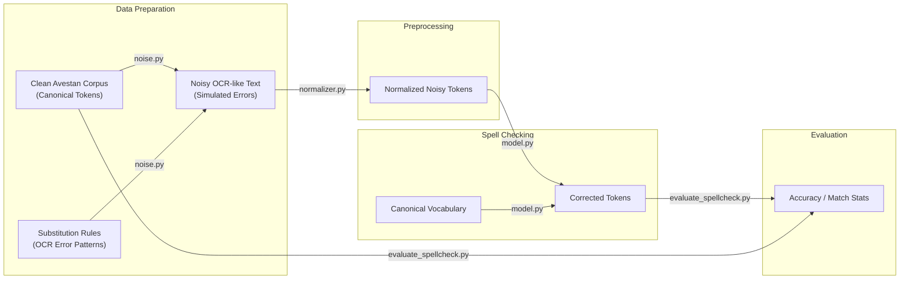

```mermaid
graph LR

  %% Invisible class for padding nodes (prevents title overlap)
  classDef invisible fill:transparent,stroke:transparent,opacity:0;

  %% -------- Data Preparation --------
  subgraph "Data Preparation"
    pad1[" "]:::invisible
    clean_text["Clean Avestan Corpus<br/>(Canonical Tokens)"]
    noisy_text["Noisy OCR-like Text<br/>(Simulated Errors)"]
    substitution_rules["Substitution Rules<br/>(OCR Error Patterns)"]

    clean_text -->|"noise.py"| noisy_text
    substitution_rules -->|"noise.py"| noisy_text
  end

  %% -------- Preprocessing --------
  subgraph "Preprocessing"
    pad2[" "]:::invisible
    normalized_text["Normalized Noisy Tokens"]

    noisy_text -->|"normalizer.py"| normalized_text
  end

  %% -------- Spell Checking --------
  subgraph "Spell Checking"
    pad3[" "]:::invisible
    corrected_output["Corrected Tokens"]
    canonical_vocab["Canonical Vocabulary"]

    normalized_text -->|"model.py"| corrected_output
    canonical_vocab -->|"model.py"| corrected_output
  end

  %% -------- Evaluation --------
  subgraph "Evaluation"
    pad4[" "]:::invisible
    evaluation_report["Accuracy / Match Stats"]

    corrected_output -->|"evaluate_spellcheck.py"| evaluation_report
    clean_text -->|"evaluate_spellcheck.py"| evaluation_report
  end
```
